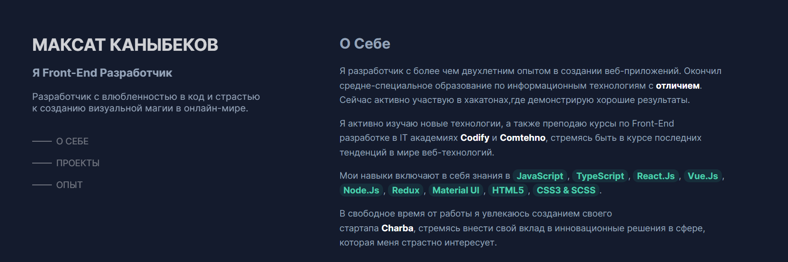

# My portfolio 

# My reports for every day

1. [28.11.2023] First day 
**Initialization of the project**
2. [29.11.2023] Second day 
**Developed the left panel, with basic information**
3. [30.11.2023] Third day
**Added animation library**
4. [01.12.2023] Fourth day 
**Added "About me" section**
5. [02.12.2023] Fifth day
**Added "Experience" section**
6. [03.12.2023] Sixth day
**Added "Projects" section**
7. [04.12.2023] Seventh day
**Added "Awards" section**
8. [05.12.2023] Eighth day
**Change color pallette**
9. [06.12.2023] Nineth day
**Added js**
10. [07.12.2023] Tenth day
**Install React.js**
11. [08.12.2023] Eleventh day
**React.js config**
12. [09.12.2023] Twelfth day
**Transfered the code from html to**
13. [10.12.2023]  Thirteenth day
**Create componemts**
14. [11.12.2023] Fourteenth day
**Install react-router-dom**
15. [12.12.2023] Fifteenth day
**Breakdown into components**
16. [13.12.2023] Sixteenth day
**Styled Experience card and create Spotlight**
17. [14.12.2023] Seventeenth day
**Added routing**
18. [15.12.2023] Eighteenth day
**Added data base (projects, experience)**
19. [16.12.2023] Nineteenth day
**Refactoring**
20. [17.12.2023] Twentieth day 
**Added experience**
21. [18.12.2023] Twenty first day
**Refactoring**
22. [19.12.2023] Twenty-second day 
**Experience Refactoring**